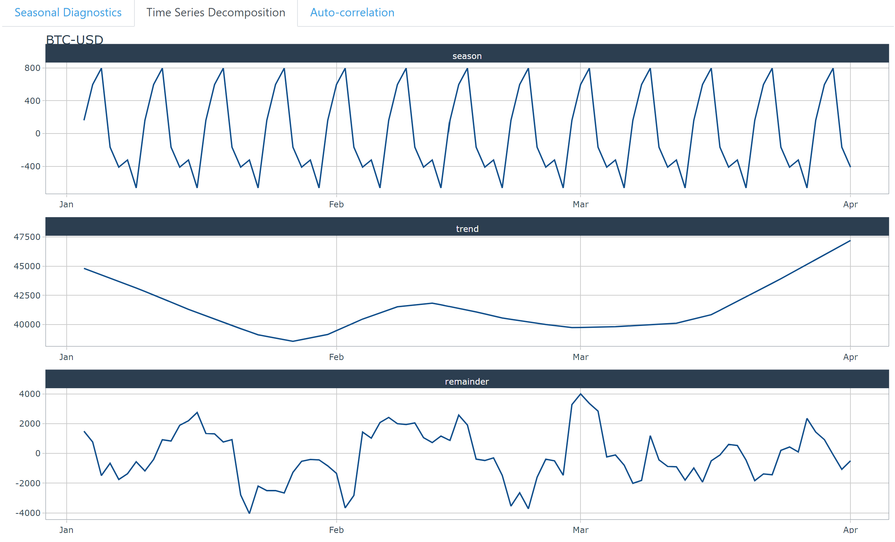
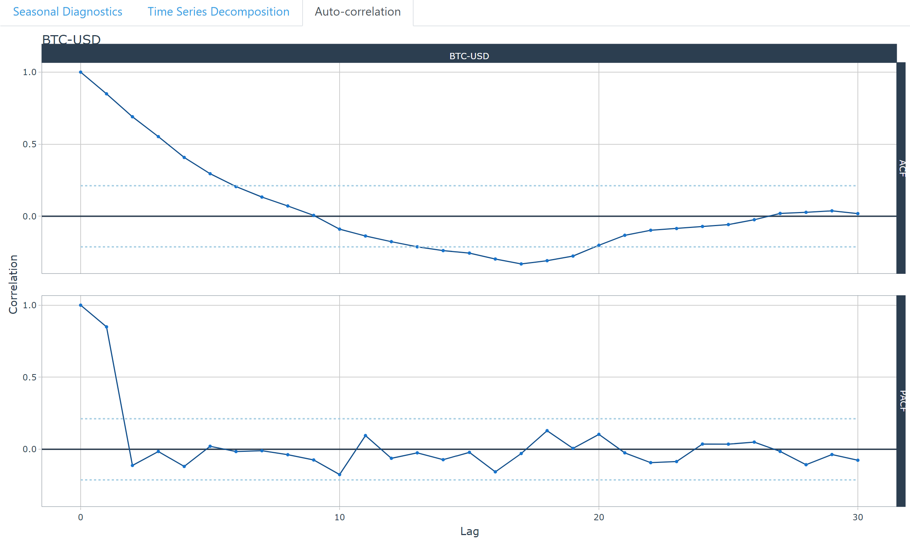

```{r, include=FALSE}
knitr::opts_chunk$set(echo = FALSE,
                      warning = FALSE,
                      tidy = FALSE,
                      message = FALSE,
                      fig.align = 'center',
                      out.width = "100%")
options(knitr.table.format = "html") 
```

```{r echo=FALSE, eval=FALSE}
library(pagedown)
pagedown::chrome_print("index.html")
```

# Motivation

Cryptocurrency, or **`crypto`**, is a digital or virtual currency that is secured by cryptography. Trading cryptocurrencies is not as simple as trading in the traditional stock market. Many will face the volatility, and one incorrect move, the trader will lose a fortune. The crypto world is not for the faint of heart. 

With the rapid increase in interest in cryptocurrencies, we are motivated to dive deep into the crypto world to look at the performance of the currencies through a period of time.

The aim is to create an R Shiny application to encourage anyone, who is interested to invest in cryptocurrencies, to get more insights before making a decision to buy into a cryptocurrency. 

# Methodology 

To develop the dashboard, we carried out the following steps: 

1. **Data wrangling and transformation**: The scripted dataset are tidied into formats that can be read by the R packages used e.g. using daily prices, converting the data into tibble format that is ideal for time series analysis. 
2. **Exploratory and Seasonal analysis**: Using suitable graphical and time series decomposition methods to reveal the seasonal patterns 
3. **Predictive analysis**: Modelling the time series using various forecasting algorithms and predict future prices. 
4. **Interactive dashboard**: Develop and publish an interactive dashboard containing the above components

{ width=80% }

# Exploratory 

Exploratory data analysis consists of three categories: Horizon Graph using  package, Anomaly Diagnostics and a simple time series plot.  

{ width=90% }

Horizon Graph depicts the historical prices of many crypto currencies in one visualisation, as a quick way to identify similar patterns across the currencies. Blue represents the negative value, red for positive. The darker the color, the greater the fluctuation. ggHoriPlot is used for building horizon plots in ggplot2.

{ width=90% }

Simple Time series: use a line plot to demonstrate the evolution of the time series over time. In this app, a time series plot is designed to allow users to compare the time series pattern of selected crypto currencies and identify the coins for further analysis.

{ width=90% }

**`Anomaly Diagnostics`** is to detect and visualise anomalies which can signify special events, and to identify anomalies for cleaning to improve forecast error. The UI panel is designed for the users to obtain analysis upon selection of desired date range.

# Seasonality & Correlation

Time series generally consist of three components: a trend-cycle component, a seasonal component, and a remainder component (containing anything else in the time series). 

The STL diagnostics and seasonality diagnostics of the **`timetk`** package are used to decompose the time series, and extract these components out to facilitate identification of patterns. 

{ width=90% }

**`seasonality diagnostics:`** to visualize time series seasonality by different time periods (days, week, weekday, quarter, year)

{ width=90% }

**`stl diagnostics:`** using the STL methodology to separate the "season" and "trend" components from the "observed" values leaving the "remainder".

{ width=90% }

**`Autocorrelation`** measures the linear relationship between lagged values of a time series. In this app, we used ACF, auto-correlation between a target variable and lagged versions of itself, and the PACF, partial autocorrelation that removes the dependencies of lags on other lags. These are useful to visualize the strength of the seasonal patterns of the data (when data are seasonal, the auto-correlations will be larger for the seasonal lags). 

# Prediction

The predictive feature in the application to train some of the machine learning models with respective visualization and a performance matrix of the trained models and prediction comparison for the selected cryptocurrency. 

{ width=90% }

The selected models that we used for predictions are ARIMA, Prophet, ElasticNet, Random Forest, XGBoost, SVM, ARIMA Boosted, Prophet Boosted. 

{ width=90% }

# Future Works

The use of timetk and modeltime generally offer a straightforward and efficient way to generate common time series visualization.  By tweaking the codes, future adaptations could be easily carried out to compare the major cryptocurrencies against other investment assets like gold, or major stock market ETFs like S&P 500. This will allow potential investors to better understand the risks and potential returns they could derive from different investments.   

It is also notable that the study did not fully explore the functionalities of the R packages. For instance, Timetk has a function to compute the cross correlation (CCF).  

It is not as straightforward as it requires the data to be in a single tibble, hence some data wrangling will need to be done if users want to compare with predictors where the information comes from another source.  

Other R packages for time series analysis, such as feasts could be explored for an extension of the project.

We can look into other prediction models, such as Long Short Term Memory (LSTM), to have additional prediction and have more comparisons amongst the available prediction models. We can also look at data transformation to improve the prediction. 

```{r, include=FALSE}
knitr::write_bib(c('posterdown', 'rmarkdown','pagedown'), 'packages.bib')
```