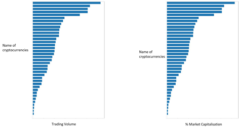
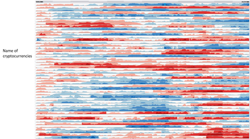
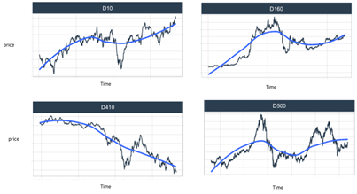
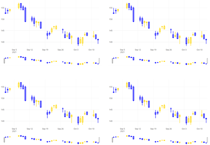
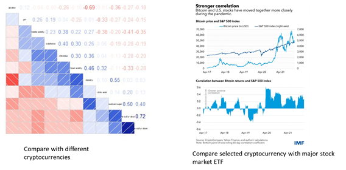
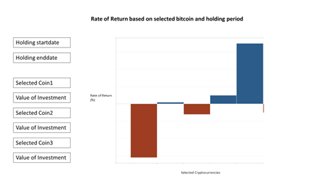
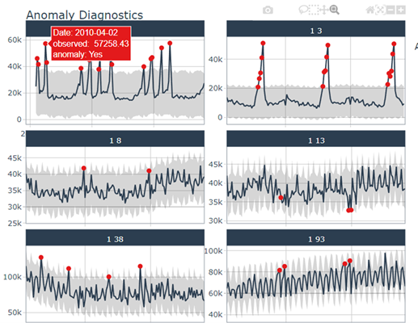
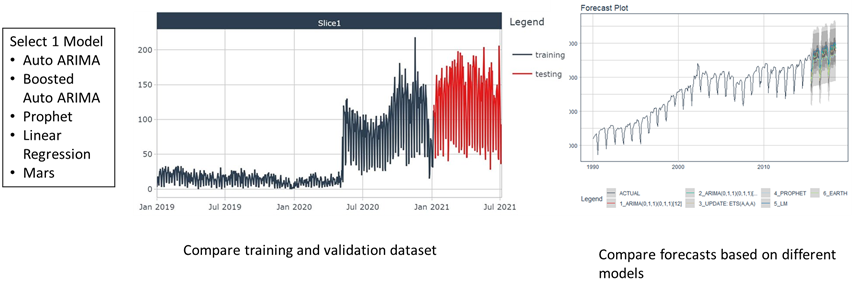
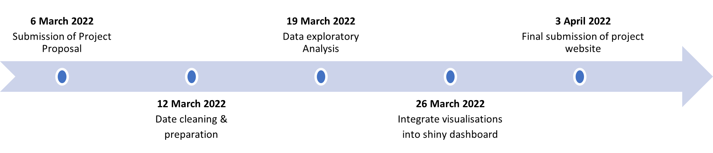

```{r setup, include=FALSE}
knitr::opts_chunk$set(echo = TRUE,
                      fig.retina = 3,
                      fig.width=10, 
                      fig.height=10,
                      cache = FALSE,
                      message = FALSE,
                      warning = FALSE,
                      eval = TRUE)
```

# Introduction

Cryptocurrency is a digital currency that is secured by cryptography that will deter the possibility of counterfeiting the currency. There are several types of cryptocurrency and most of them are decentralized networks based on blockchain technology. The most prominent feature about a digital currency is that these currencies are generally not issued by any central authority. 

According to Yahoo Finance, until 6th March 2022, the crypto market cap of the top 30 croptos by market cap is $1.612T. The market volume of top 30 crypto within 24 hours was $84.39B, making a 35.64% decrease compared to the day before. The cryptocurrency market is highly volatile, and is deemed so risky that the Monetary Authority of Singapore has issued guidelines to curb cryptocurrency trading being promoted to the public. Nonetheless, there is still high interest, and it will be useful to allow users to discover how the market has changed, and for them to make a more informed decision on their investment.

# Motivation and Objectives
The main motivation of this project is the lack of interactive web-enabled visualisations to compare and allow users to easily identify generalised patterns of multiple crypto currencies at one-go. The analyses that are available to the public are usually those comparing the few common crypto currencies, in fact many focussed on bitcoin only since it’s the most well known one. However, there are currently over 9,000 crypto currencies in the market. 

It would be interesting to see if the trends and patterns are similar for other crypto currencies, beyond bitcoin. It will also be useful for prospective investors to predict the price movements of crypto currencies based on traditional and recently-developed algorithms.

The project aims to provide a user-friendly web-enabled application for users to visualise trends and patterns in an interesting and interactive manner. The specific objectives are:

- To effectively visualise the price movement patterns at different levels, based on the selected time periods and crypto currencies of interest
- To determine the relationship between different crypto currencies, and how major stock market trends could influence the prices.
- To provide an easy way for investors to determine their portfolio returns based on selected crypto currencies, based on historical patterns and forecasted trends. 

# Data Description
The main dataset will be scripted from [Yahoo Finance](https://finance.yahoo.com/quote/) which will contain two years worth of data, from 1st January 2020 till end Feb 2022, with top 30 cryptocurrencies based on market cap.

# Methodology and Approach
The proposed visualisations that will be used for this project include the following:

**Exploratory Analysis (data discovery)**

- Simple bar charts in hierarchical order: This is to visualise the top traded cryptocurrencies (based on a given time), by trading volume and the market capitalisation (by comparing across the various currencies in terms of percentage total).



- Horizon graph: This is to show the historical prices of many crypto currencies in one visualisation, as a quick way to identify similar patterns across the currencies. 



- Time-series plot (faceted): This is to compare the time series pattern of selected crypto currencies.



- Candlestick: This is to show a good summary of the crypto currencies’ behaviour, in terms of its high, low, open and closing prices.



**Statistical/Inferential Analysis**

- Correlation plots (e.g. correlogram,line charts to plot the correlation values over a time period): This is to determine if there is any relationship between the selected crypto currencies, as well as the major stock market ETFs e.g. S&P 500. It is useful to find out the correlation to determine the amount of diversification of assets in a portfolio, and see how crypto currencies could be affected by factors such as overall stock market trend.



- Portfolio analysis: This is useful for investors to determine and compare the rate of return based on the crypto currencies that they are currently trading or consider investing in.



**Predictive analysis**

- Anomaly detection: This is to detect and visualise anomalies which can signify special events, and to identify anomalies for cleaning to improve forecast error.



- Forecast modelling: This is to apply suitable time series models to predict the prices of crypto currencies, and to compare the results of the various forecast models quickly. From this, investors could predict their potential rate of returns.



# R packages
The software used for this project is R, and the R packages that are going to be applied based on the above proposed visualisations are: 

::: l-body
| Packages | Purpose |
|----------|---------|
| Shiny and Shiny dashboard	| To build interactive web application and visualisations |
| Tidyverse	| To tidy up and manipulate the data |
| Plotly	| To create interactive graphs |
| ggplot2	| To create static graphs |
| modeltime	| To build time series forecast models using various methods such as classical methods(ARIMA), new methods (Prophet) and machine learning (Tidymodels) | 
| ggHoriPlot	| To build horizon plots in ggplot2 | 
| tidyquant	| To script cryptocurrency data for time series analysis from Yahoo Finance and to re-format the dataset into dataframe or tidyverse format | 
| timetk	| To create interactive visualization, tidy time series data  wrangling and preprocess time series data |
| Quantmod	| To plot candlestick charts |
| corrgram	| To plot correlogram |
::: 

# Project Milestones



# References

- [Cryptocurrencies](https://finance.yahoo.com/cryptocurrencies/)
- [Factors Influencing Cryptocurrency Prices](https://ideas.repec.org/a/trp/01jefa/jefa0016.html)
- [Model Time](https://business-science.github.io/modeltime/)
- [Plotting Time Series](https://cran.r-project.org/web/packages/timetk/vignettes/TK04_Plotting_Time_Series.html)
- [Anomly Detection](https://business-science.github.io/timetk/articles/TK08_Automatic_Anomaly_Detection.html#anomaly-visualization)
- [Quant Mod](https://www.quantmod.com/)
- [Crypto Prices Move More In Sync With Stocks](https://blogs.imf.org/2022/01/11/crypto-prices-move-more-in-sync-with-stocks-posing-new-risks/)
- [Crypto Trading, Straits Times](https://www.straitstimes.com/business/companies-markets/crypto-trading-should-not-be-promoted-to-the-public-under-new-mas-guidelines)
- [Top Crpyto By Market Cap](https://finance.yahoo.com/u/yahoo-finance/watchlists/crypto-top-market-cap/)


